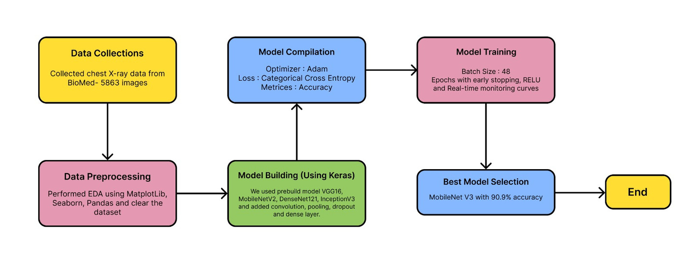
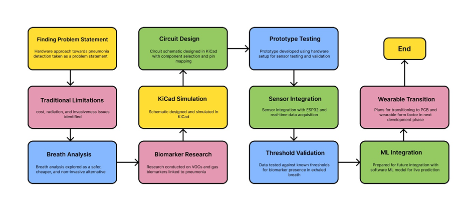
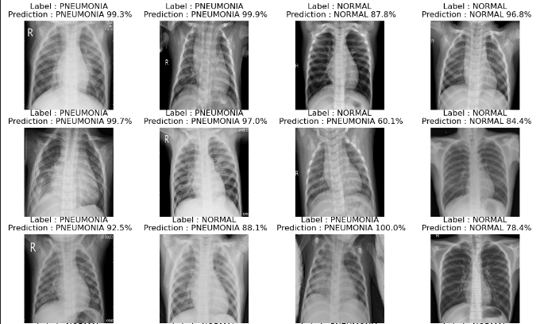
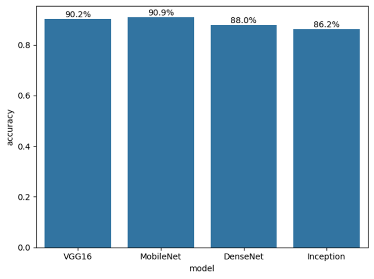
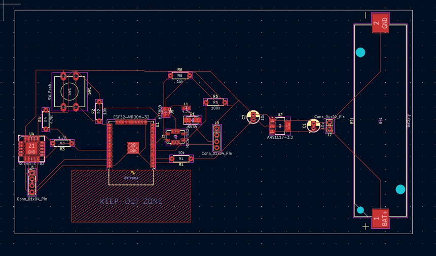
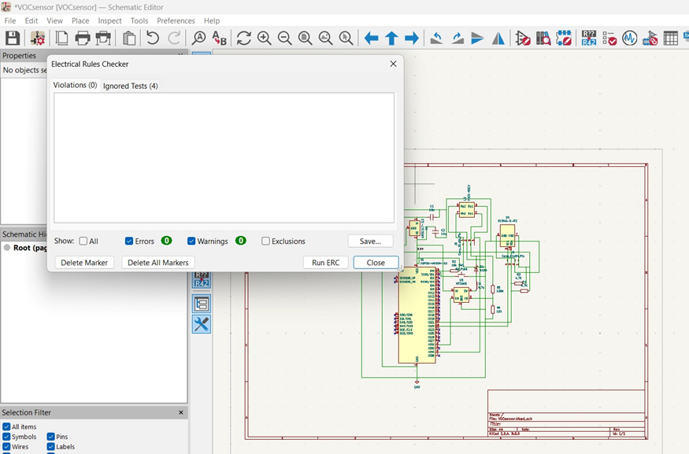

# Pneumonia Detection System

### Deep Learning + IoT-Based Hybrid Diagnostic System

**A non-invasive, AI-powered pneumonia detection system combining chest X-ray analysis with real-time breath biomarker monitoring**

[Overview](#overview) | [Features](#key-features) | [Results](#results) | [Hardware](#hardware-design) | [Team](#team)

---

## Overview

Pneumonia is a severe respiratory infection affecting millions worldwide. This capstone project introduces a **dual-diagnostic approach**:

| Approach | Method | Technology |
|----------|--------|------------|
| **AI Detection** | Chest X-ray Classification | CNN (MobileNetV2, VGG16) |
| **Breath Analysis** | Exhaled Biomarker Detection | VOC/NO2/CO2 Sensors |

---

## Key Features

- **High Accuracy**: MobileNetV2 achieves **90.9% accuracy**
- **Non-Invasive**: Breath analysis eliminates radiation exposure
- **Portable**: ESP32-based point-of-care diagnostics
- **Low-Cost**: Affordable for developing regions
- **Real-Time**: Wireless data transfer

---

## System Architecture

---

## Deep Learning Models

| Model | Accuracy | Best For |
|-------|----------|----------|
| **MobileNetV2** | **90.9%** | Embedded deployment |
| VGG16 | 90.2% | Baseline/Server |
| DenseNet121 | 88.0% | Balanced |
| InceptionV3 | 86.2% | High accuracy needs |

### Model Comparison

---

## Results

### Training Performance

<table>
<tr>
<td></td>
<td></td>
</tr>
</table>

### Confusion Matrices

<table>
<tr>
<td></td>
<td></td>
</tr>
</table>

---

## Hardware Design

| Component | Model | Function |
|-----------|-------|----------|
| **MCU** | ESP32 | Processing + Wi-Fi |
| **VOC Sensor** | MiCS 5524 | VOC detection |
| **NO2 Sensor** | MiCS 2714 | NO2 measurement |
| **CO2 Sensor** | SCD40 | CO2 monitoring |

### Circuit Schematics

<table>
<tr>
<td></td>
<td></td>
</tr>
</table>

---

## Documentation

**[Final Presentation (PDF)](docs/presentation/Final%20Review%20PPT.pdf)**

---

## Team

**VIT Vellore** - School of Electronics Engineering (SENSE)

| Name | Role |
|------|------|
| **Rupam Mal** | ML Engineer |
| **Harsh Kumar** | Integration and Documentation |
| **Debtonu Bose** | Hardware Engineer |

**Guide**: Dr. Prachi Sharma | **Capstone Project 2024-2025**

---

## Future Work

- [ ] Deploy on ESP32 with TensorFlow Lite
- [ ] Develop mobile app
- [ ] Clinical validation

---

**VIT Vellore | 2024-2025**

