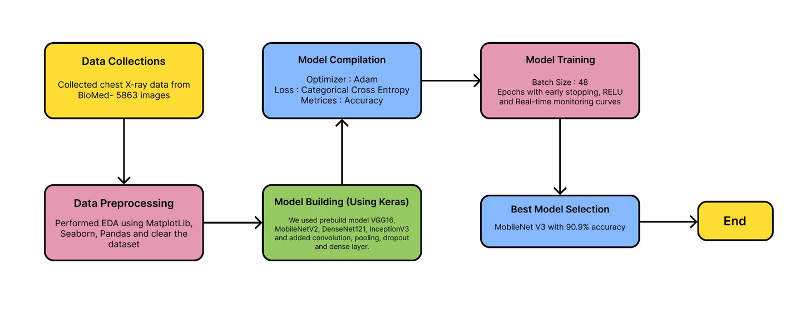
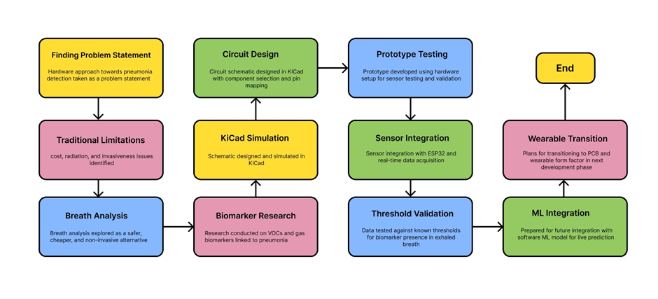
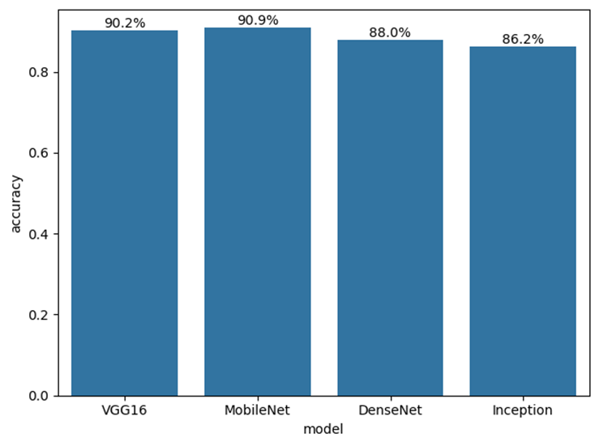
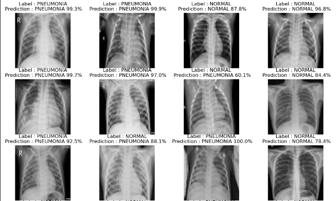
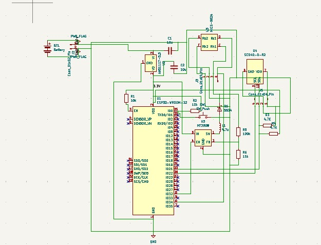
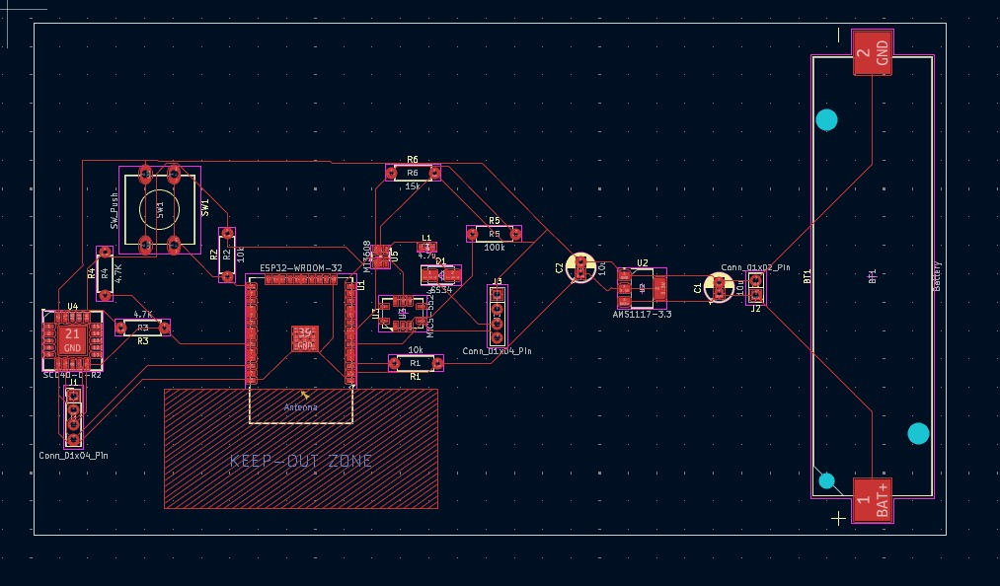

# Pneumonia Detection System

### CNN-based Chest X-ray Classification + ESP32 Breath-Sensor Prototype

[Overview](#overview) | [Models](#deep-learning-models) | [Results](#results) | [Hardware](#hardware-design) | [Team](#team)

---

> **Disclaimer**: This is an academic B.Tech capstone project built for learning purposes. It is **not** a certified medical device and has **not** been clinically validated. Nothing here should be used to make an actual diagnostic decision.

## About

B.Tech Capstone Project developed at VIT Vellore, December 2024 – May 2025. The project explores two independent, complementary approaches to non-invasive pneumonia screening: a CNN image classifier for chest X-rays, and a breath-biomarker sensing prototype built around an ESP32.

| | |
|---|---|
| **Institution** | VIT Vellore |
| **Duration** | December 2024 - May 2025 |
| **Team Size** | 3 |
| **Role** | Team Lead |
| **Tools** | KiCad, TensorFlow/Keras, VSCode |

### What was built

- Trained and evaluated four CNN architectures (VGG16, MobileNetV2, DenseNet121, InceptionV3) via transfer learning on a chest X-ray dataset of 5,863 labeled images (Normal / Pneumonia). Best result: **MobileNetV2 at 90.9% test accuracy**.
- Designed and assembled an ESP32-based breath-analysis prototype with VOC (MiCS-5524), NO2 (MiCS-2714), and CO2 (SCD40) sensors.
- Designed the power distribution circuit (dual 3.3V Li-ion cells with buck/LDO regulation) in KiCad.
- Breath-biomarker readings are currently compared against fixed thresholds. Running the trained CNN on-device and combining both signals into a single live prediction is listed under [Future Work](#future-work) — it was not completed in this phase of the project.

---

## Overview

| Approach | Method | Status |
|----------|--------|--------|
| **X-ray Classification** | CNN (MobileNetV2 best, also VGG16/DenseNet121/InceptionV3) | Trained and evaluated offline; not yet deployed to the ESP32 |
| **Breath Analysis** | VOC / NO2 / CO2 sensors on ESP32 | Hardware prototype built; readings evaluated against fixed thresholds (no ML integration yet) |

The two approaches were developed and evaluated separately. Full integration into a single wearable device with live, ML-driven breath classification is future work, not a finished system.

---

## Development Workflow

<table>
<tr>
<td align="center"> CNN model development pipeline</td>
<td align="center"> Breath-sensor hardware development pipeline</td>
</tr>
</table>

---

## Deep Learning Models

Four pretrained CNN backbones were fine-tuned with transfer learning (Adam optimizer, categorical cross-entropy loss, batch size 48, early stopping) and compared on test accuracy:

| Model | Test Accuracy |
|-------|----------|
| **MobileNetV2** | **90.9%** |
| VGG16 | 90.2% |
| DenseNet121 | 88.0% |
| InceptionV3 | 86.2% |

These numbers come from the project's own evaluation results (see chart below); no other performance metrics (precision/recall/F1, external test sets, etc.) are recorded in this repository.

---

## Results

### Model Accuracy Comparison

### Sample Predictions

Example outputs from the trained MobileNetV2 model on test images, with predicted label and confidence:

---

## Hardware Design

| Component | Model | Function |
|-----------|-------|----------|
| **MCU** | ESP32 | Sensor readout + Wi-Fi |
| **VOC Sensor** | MiCS-5524 | VOC detection |
| **NO2 Sensor** | MiCS-2714 | NO2 measurement |
| **CO2 Sensor** | SCD40 | CO2 monitoring |
| **Power** | Dual 3.3V Li-ion + buck/LDO regulation | Sensor power supply |

### Circuit Schematics (KiCad)

<table>
<tr>
<td></td>
<td></td>
</tr>
</table>

---

## Repository Contents

This repository holds the project's **documentation, diagrams, and hardware schematics**. Training/inference code and the dataset are not included (dataset was too large to check in; model files are also excluded — see `.gitignore`). For the full write-up and methodology, see the presentation below.

## Documentation

**[Final Presentation (PDF)](docs/presentation/Final%20Review%20PPT.pdf)**

---

## Team

**VIT Vellore** - School of Electronics Engineering (SENSE)

| Name | Role |
|------|------|
| **Debtonu Bose** | Team Lead, Hardware Engineer |
| **Rupam Mal** | ML Engineer |
| **Harsh Kumar** | Integration and Documentation |

**Guide**: Dr. Prachi Sharma | **Capstone Project 2024-2025**

---

## Author

**Debtonu Bose**
B.Tech Electronics and Communication Engineering
Vellore Institute of Technology (2021-2025)

---

## Future Work

- [ ] Deploy the trained CNN to the ESP32 (e.g. via TensorFlow Lite) for on-device inference
- [ ] Integrate ML-based classification into the breath-sensor pipeline (currently threshold-based only)
- [ ] Move from breadboard prototype to a wearable PCB form factor
- [ ] Develop a companion mobile app
- [ ] Clinical validation
- [ ] Bacterial vs. viral pneumonia classification

---

**VIT Vellore | Capstone Project | 2024-2025**

